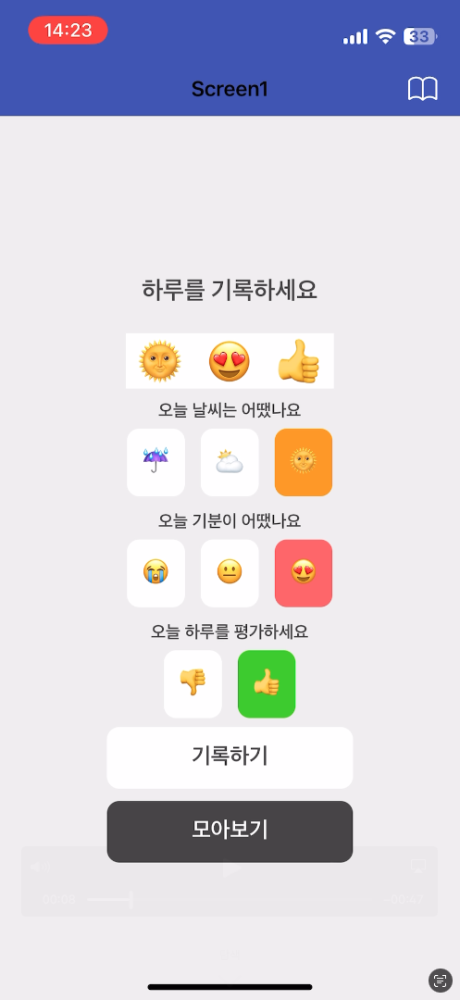
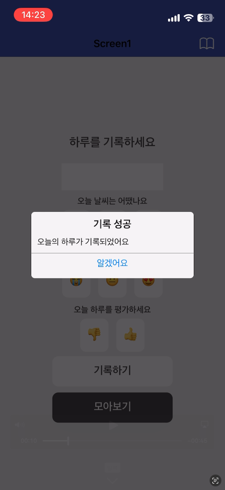

# Weather Emotion Diary

## 요약

## 상세

1번째 PJT

### 0. 목차

1. 소개
2. 기술 스택
3. 느낀 점
4. 기능 (페이지 구성)
5. 아쉬웠던 부분
6. 앞으로 학습할 것들, 나아갈 방향
7. 어려웠던 부분, 해결한 과정

## 1. 소개

**Weather Emotion Diary**

주제

- `Scratch`를 이용한 모바일 애플리케이션
- 오늘의 기분, 날씨, 평가를 클릭해 저장

## 2. 기술 스택

`Scratch`

## 3. 느낀 점

- `Scratch`는 아이들 교육용인 줄 알았는데, 쓸만한 앱을 간단하고 편하게 만들 수 있었음

## 4. 기능 (페이지 구성)

1. 종합 상태창
2. 날씨 버튼 3가지, 기분 버튼 3가지, 평가 버튼 2가지
3. 기록, 목록 버튼
4. 목록의 아이템을 클릭하면 삭제

|                                                  |                                                        |                                                  |
| :----------------------------------------------: | :----------------------------------------------------: | :----------------------------------------------: |
| 메인 화면  |    버튼 클릭     | 기록 성공  |
|        목록         | 아이템 삭제  |                                                  |

시연 영상

- `assets` 폴더 내

## 5. 아쉬웠던 부분

- 학습을 하지 못하고, 프로젝트 작업일 중간에 들어와 시간이 많지 않았음
- 클라우드에 저장하는 기능을 추가하고 싶었으나, 시간상 하지 못함

## 6. 앞으로 학습할 것들, 나아갈 방향

## 7. 어려웠던 부분, 해결한 과정

- `Scratch`에서는 변수를 다른 페이지에 어떻게 넘기는지 몰랐음
- 전역 변수를 만들어 관리했는데, 구현에 급급해 변수 이름을 제대로 짓지 못함
